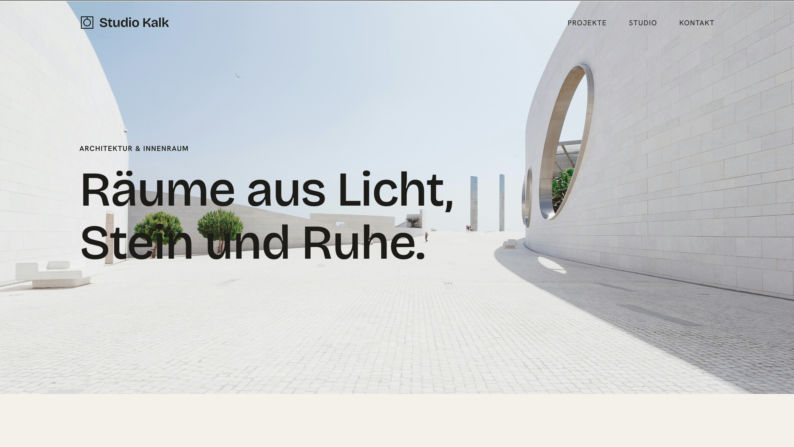

# Studio Kalk

A fictional architecture studio website — a portfolio project built to practice a multi-page site, a premium/editorial design system, and dynamic content rendered from JSON via `fetch`.

## About

Studio Kalk doesn't exist — it's a made-up architecture and interior design studio used as a realistic brief for this project. All project photography is sourced from free stock libraries (Unsplash / Pexels) for demonstration purposes only and does not depict real work by any studio.

The goal was a site that reads as calm and considered rather than template-y: a restrained "warm limestone" color palette, a display/body font pairing, and generous whitespace, paired with real data-driven pages instead of hardcoded HTML.

## Features

- **5 pages**: Home, Projects overview, Project detail, Studio, Contact
- **Data-driven projects** — all project content lives in [`projects.json`](projects.json) and is fetched and rendered at runtime, including a single reusable detail-page template driven by a `?id=` URL parameter
- **Sticky header** that turns transparent over the hero image and solidifies on scroll
- **Mobile navigation** — full-screen panel with scroll lock and an animated menu/close icon swap
- **Custom design system** — colors, type scale, spacing scale and layout tokens defined once as CSS custom properties (`css/standart.css`) and reused everywhere
- Fully responsive, built mobile-first alongside desktop

## Tech stack

Plain HTML5, CSS3 and vanilla JavaScript — no frameworks, no build step, no dependencies.

- **JavaScript**: `fetch` + `async`/`await`, `URLSearchParams`, template-literal HTML generation, `IntersectionObserver`-free scroll handling
- **CSS**: custom properties, Grid & Flexbox, `clamp()` for fluid type, no preprocessor
- Self-hosted variable-free webfonts (Bricolage Grotesque for headings, Hanken Grotesk for body text)

## Status

Portfolio project — content and photography are placeholders, the contact form has no backend.
